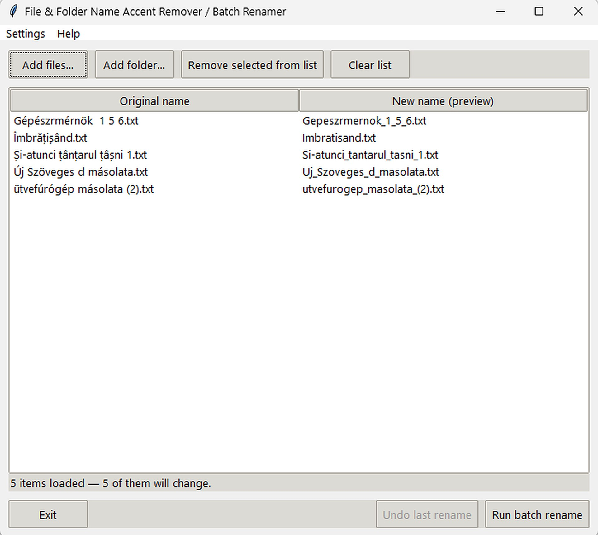
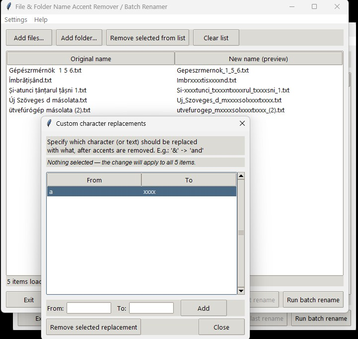
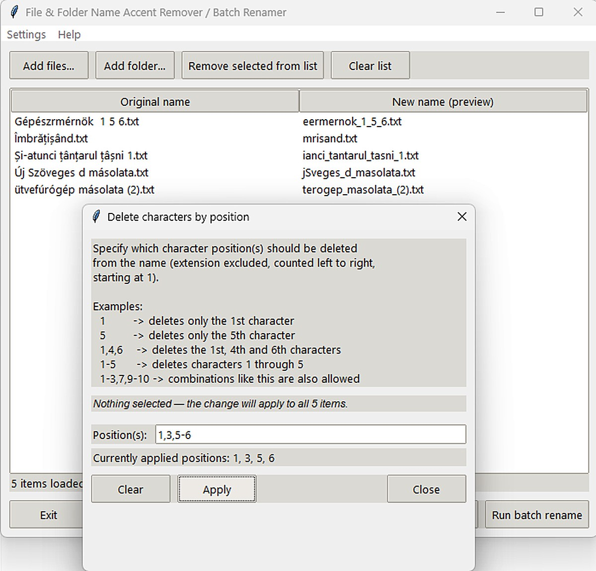

# Atnevezo

### Batch File & Folder Renamer for Windows

<p align="center">


</p>

A lightweight and portable Windows application for batch renaming files and folders.

The program removes accented characters, replaces spaces, performs custom text replacements, previews every change before execution, and safely renames multiple files or folders in a single operation.

No installation is required when using the released executable.

---

# Main Window

<p align="center">
    
</p>

The main interface provides all renaming options in one place. You can load files or folders, configure rename rules, preview the results, and execute batch operations safely.

---

# Features

- Batch rename files and folders
- Remove accented characters
- Replace spaces with underscores (`_`)
- Custom character and text replacements
- Delete characters by position
- Live preview before renaming
- Undo the last batch rename operation
- Hungarian and English user interface
- Supports both files and folders
- No external dependencies
- Portable executable

---

# Selection

The file list supports familiar Windows selection methods.

### Mouse

- Left Click – Select a single item
- **Ctrl + Left Click** – Add or remove individual items from the selection
- **Shift + Left Click** – Select a continuous range of items
- Right Click – Preserves the current selection and opens the context menu

### Keyboard

- **Ctrl + A** – Select all items
- **Esc** – Clear the current selection

---

# Preview

<p align="center">
    
</p>

Preview all filename changes before renaming. This helps prevent mistakes and gives full control over the final result.

---

# Batch Rename

<p align="center">
    
</p>

Rename multiple files and folders quickly and safely with a single click.

---

# System Requirements

## Operating System

- Windows 10 (64-bit)
- Windows 11 (64-bit)

## Minimum Hardware

- 1 GHz 64-bit processor
- 2 GB RAM
- 30 MB free disk space

## Recommended

- Dual-core processor
- 4 GB RAM or more
- Full HD (1920×1080) display

---

# Portable Executable

The released executable is completely portable.

- No installation required
- No administrator privileges required
- Python is not required
- Single executable file

---

# Running from Source

```bash
python atnevezo.py
```

---

# Building the Executable

```bash
python -m PyInstaller --onefile --windowed --clean --name Atnevezo atnevezo.py
```

The executable will be created inside the `dist` folder.

---

# License

This project is licensed under the **MIT License**.

See the **LICENSE** file for details.

---

# Author

Created and designed by **Szabiz**.

Developed with the assistance of **OpenAI ChatGPT**.
